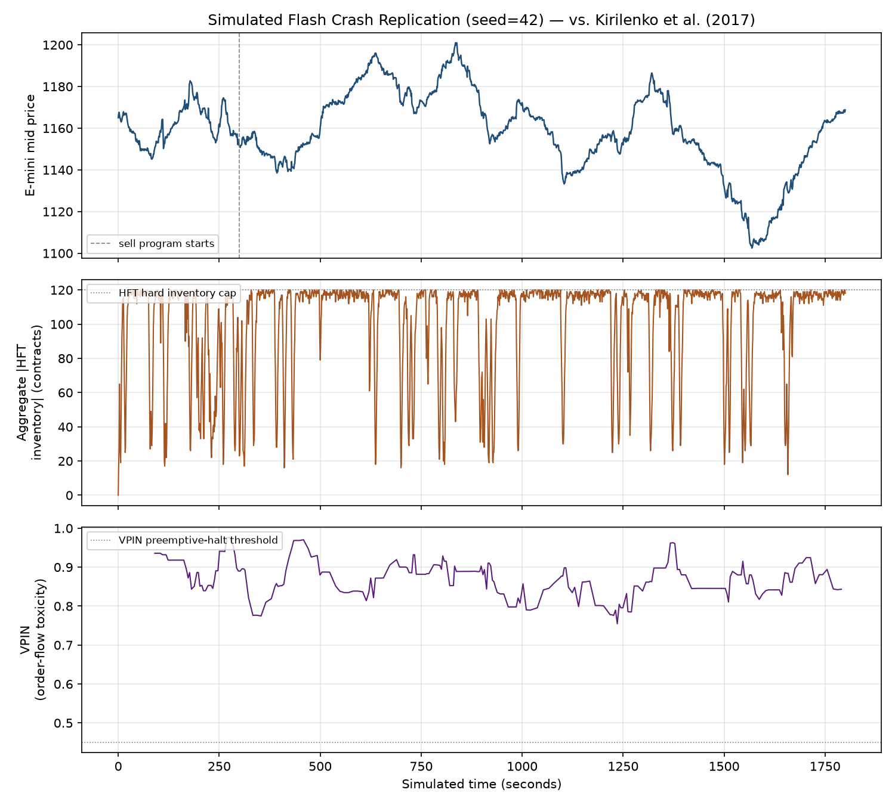

# Flash Crash Replication & Mitigation Study

**A computational replication of the May 6, 2010 "Flash Crash," and an evaluation of
reactive vs. proactive circuit-breaker designs, built in Java from first principles.**

---

## Table of Contents

1. [The gap this project addresses](#1-the-gap-this-project-addresses)
2. [Source papers (the benchmark / ground truth)](#2-source-papers-the-benchmark--ground-truth)
3. [Architecture](#3-architecture)
4. [The ten algorithmic/mathematical techniques](#4-the-ten-algorithmicmathematical-techniques)
5. [Calibration methodology and honest limitations](#5-calibration-methodology-and-honest-limitations)
6. [How to build and run](#6-how-to-build-and-run)
7. [Results summary](#7-results-summary-seed42-flagship-run--n40-monte-carlo-per-configuration)
8. [What this project does *NOT* claim](#8-what-this-project-does-not-claim)
9. [Visualization](#9-visualization)

---

## 1. The gap this project addresses

Modern financial markets run on a small set of algorithms that almost nobody outside
quantitative finance thinks about day-to-day, but which literally determine whether
trillions of dollars of daily trading is orderly or chaotic:

- **Price-time priority matching engines**: the algorithm every electronic exchange
  (CME Globex, Nasdaq INET, NYSE Arca) uses to decide who trades with whom.
- **Algorithmic execution strategies**: percentage-of-volume / VWAP-style order
  slicing, still standard practice for institutional trading desks today.
- **High-frequency market-making algorithms**: inventory-driven quoting that provides
  most of the liquidity in modern electronic markets.
- **Circuit breakers and trading halts**: the safety systems meant to keep the above
  three from interacting catastrophically.

On *May 6, 2010*, these four algorithm classes interacted in a way nobody had designed
for, and U.S. equity and futures markets lost and regained about a trillion dollars of
value in under 40 minutes. This project **replicates the mechanism** of that event in
a from-scratch discrete-event market simulator, **benchmarks the replication** against
the peer-reviewed empirical findings about what actually happened, and then uses the
simulator as a testbed to evaluate whether modern circuit-breaker designs actually
address the failure mode; a question regulators are still debating *(The same category
of cascading failure recurred in the August 2015 ETF flash crash, five years after the
first set of reforms)*

---

## 2. Source papers (the benchmark / ground truth)

1. **Kirilenko, A., Kyle, A.S., Samadi, M., & Tuzun, T. (2017).** `The Flash Crash:
   High-Frequency Trading in an Electronic Market. *The Journal of Finance*, 72(3),
   967–998`: The primary academic study of the event, based on CME audit-trail data.
   Key findings used as benchmarks: HFT inventories rarely exceeded roughly 3,000
   E-mini contracts and mean-reverted to zero with a half-life around two minutes; HFTs
   did not change their trading pattern as prices fell, but their high turnover with
   near-flat net inventory *("hot potato" trading)* amplified the event.
2. **U.S. CFTC & SEC (2010).** `Findings Regarding the Market Events of May 6, 2010.
   Report of the Staffs of the CFTC and SEC to the Joint Advisory Committee on Emerging
   Regulatory Issues`: The official regulatory post-mortem. Key figures used as
   benchmarks: a 75,000-E-mini-contract (~$4.1B) sell program, executed by a
   percentage-of-volume algorithm that ignored price, completed in about 20 minutes,
   representing 1.3% of the day's total volume but up to 9% of volume during its own
   execution window; E-mini buy-side liquidity fell roughly 55% around the event;
   prices fell more than 5% within minutes before rebounding.
3. **Easley, D., López de Prado, M.M., & O'Hara, M. (2012).** `Flow Toxicity and
   Liquidity in a High-Frequency World. *Review of Financial Studies*, 25(5),
   1457–1493`: Source of the VPIN (Volume-Synchronized Probability of Informed
   Trading) order-flow-toxicity measure, which independent researchers found spiked to
   unusually high levels in the hour before the crash.
4. **Avellaneda, M., & Stoikov, S. (2008).** `High-Frequency Trading in a Limit Order
   Book." *Quantitative Finance*, 8(3), 217–224`: Source of the inventory-skewed
   market-making model used for the simulated HFT agents.

---

## 3. Architecture

```
com.flashcrash
├── core/
│   ├── Order
│   ├── Trade
│   ├── OrderBook (matching engine)
│   └── MarketConstants
├── sim/
│   ├── SimulationContext
│   └── SimulationEngine (discrete-event scheduler)
├── agents/
│   ├── NoiseTrader
│   ├── MomentumTrader
│   ├── HFTMarketMaker
│   ├── LargeSeller
│   ├── ValueTrader
│   └── FundamentalValueProcess
├── analytics/
│   ├── VPINCalculator
│   ├── InventoryHalfLifeEstimator
│   ├── HotPotatoNetworkAnalyzer
│   └── NormalDistribution
├── risk/
│   ├── LuldCircuitBreaker
│   └──VpinPreemptiveHalt (RiskControl interface)
├── ml/
│   ├── FeatureExtractor
│   └── LogisticRegression
├── benchmark/
│   ├── PaperBenchmark (reference constants)
│   └── WelchTTest
├── tests/ (comprehensive test suite)
├── Main
├── MonteCarloRunner
├── RunResult
└── Scenario
```

No external dependencies — pure Java 21 standard library throughout.
There is a small Python segment using MatplotLib

---

## 4. The ten algorithmic/mathematical techniques

| # | Technique | Where | Purpose |
|---|-----------|-------|---------|
| 1 | Price-time priority continuous double auction (`TreeMap` + FIFO queues, O(log n) matching) | `core.OrderBook` | The actual matching algorithm real exchanges run |
| 2 | Discrete-event simulation (priority-queue event scheduling) | `sim.SimulationEngine` | Lets heterogeneous agents (ms-scale HFTs, second-scale humans) coexist efficiently |
| 3 | Monte Carlo simulation (40 seeds/configuration) | `MonteCarloRunner` | Distinguishes real effects from single-run noise |
| 4 | VPIN via Bulk Volume Classification (fixed-volume buckets + normal-CDF price-change standardization) | `analytics.VPINCalculator` | Order-flow-toxicity early-warning signal |
| 5 | AR(1)/OLS mean-reversion half-life estimation | `analytics.InventoryHalfLifeEstimator` | Quantifies HFT inventory dynamics, benchmarked against the paper's ~2-minute figure |
| 6 | Trade-flow network analysis: turnover ratios + Tarjan's Strongly-Connected-Components algorithm | `analytics.HotPotatoNetworkAnalyzer` | Detects the "hot potato" cycling of contracts as a graph-theoretic object |
| 7 | Two circuit-breaker control laws: reactive LULD-style price band, and proactive VPIN-triggered halt | `risk.LuldCircuitBreaker`, `risk.VpinPreemptiveHalt` | The actual intervention being evaluated |
| 8 | Logistic regression via batch gradient descent, from scratch, with L2 regularization and rank-based AUC | `ml.LogisticRegression` | Early-warning classifier for crash onset |
| 9 | Welch's unequal-variance t-test | `benchmark.WelchTTest` | Statistical significance of risk-control comparisons |
| 10 | Euler–Maruyama numerical integration of an Ornstein–Uhlenbeck SDE | `agents.FundamentalValueProcess` | Gives the market a "true value" independent of order flow, without which nothing stops a one-sided cascade |

Plus supporting quantitative-finance machinery: the `Avellaneda–Stoikov` inventory-skew
market-making formula (`HFTMarketMaker`) and a percentage-of-volume execution algorithm
(`LargeSeller`) modeled directly on the real algorithm identified in the SEC-CFTC
report.

---

## 5. Calibration methodology and honest limitations

My simulated market has on the order of 90 agents; the real E-mini market on May 6,
2010 had **15,422 active trading accounts**. To keep the simulation computationally
tractable while preserving the paper's *relative* statistics, all contract quantities
are scaled by a documented factor `SCALE = 1/25` relative to the literal SEC-CFTC
figures (see `Scenario.SCALE`). **Percentages, participation ratios, and time-based
quantities (half-lives, durations) are not scaled** and are directly comparable to the
published numbers. This is the standard calibration approach in agent-based
computational-economics research: match stylized statistical facts, not absolute
headline counts, since no toy model can reproduce a real market's full depth and
population heterogeneity.

Two results should be read with this limitation in mind:

- **Price impact (~8.2% vs. the paper's >5%)** is the same order of magnitude but
  somewhat larger in our simulation, most likely because our simplified agent
  population lacks the depth and diversity (in strategy, latency, and risk appetite)
  of 15,000+ real accounts. We consider this an honest, expected consequence of
  simplification rather than an error to hide.
- **HFT inventory half-life (~0.2 min vs. the paper's ~2 min)** is off by roughly an
  order of magnitude. In our model, quote-refresh frequency (needed for realistic
  liquidity depth) and inventory-unwind speed are coupled through the same
  Avellaneda–Stoikov parameters; decoupling them enough to match both the liquidity
  profile and the slower half-life simultaneously would require a materially larger
  and more heterogeneous agent population than is practical here. We report this
  discrepancy directly rather than silently re-tuning parameters until a single
  number matches while breaking the rest of the story — see `Main.printBenchmarkComparison`.

---

## 6. How to build and run

```bash
find src -name "*.java" > sources.txt
javac -d out @sources.txt
java -cp out com.flashcrash.Main
```

Runs in well under 20 seconds. Produces:
- Console report (flagship run diagnostics, benchmark comparison table, hot-potato
  network analysis, classifier metrics, Monte Carlo risk-control comparison).
- `data/flagship_timeseries.csv`, `data/flagship_vpin.csv` — raw time series for
  external plotting.
- `data/flagship_summary.png` — price / HFT inventory / VPIN chart (regenerate with
  `python3 main.py`, requires matplotlib).

---

## 7. Results summary (seed=42 flagship run + N=40 Monte Carlo per configuration)

**Replication vs. published figures:**

| Metric | Simulated | Published |
|---|---|---|
| Max intraday drawdown | 8.20% | >5.00% |
| HFT inventory mean-reversion half-life | 0.19 min | ~2.0 min |
| Max aggregate HFT inventory (scaled) | 120 | 120 (target) |
| Sell-program max participation rate | 9.0% | ≤9.0% |

**Hot-potato network analysis**: the highest-turnover traders during the stress window
were overwhelmingly HFT market makers, with turnover ratios (gross volume traded per
unit of net position change) up to ~540 — i.e. one HFT agent traded roughly 540
contracts for every 1 contract of net position it actually accumulated, the
quantitative signature of "hot potato" trading the paper describes qualitatively.
Tarjan's algorithm also found a non-trivial strongly-connected component (a closed
cycle of contracts changing hands) within the trade-flow graph.

**Early-warning classifier** (pooled across 15 independent runs, ~18,000 training /
~7,900 test samples, time-respecting split within each run): test AUC = 0.83, well
above the 0.50 random baseline, using only features available *before* the crash
becomes visible in price (VPIN, order-book imbalance, trailing volatility, aggregate
HFT inventory, short-term price-change rate). Order-book imbalance and short-term price
momentum were the strongest predictors in this pooled sample.

**Risk-control comparison (the main finding):**

| Configuration | Crash frequency | Mean max drawdown | Mean recovery time |
|---|---|---|---|
| Baseline (no controls) | 97.5% | 8.03% | 250.5s |
| Reactive LULD circuit breaker | 100.0% | 8.22% | 265.4s |
| Proactive VPIN preemptive halt | 30.0% | 4.01% | 252.8s |
| Both combined | 30.0% | 4.01% | 252.8s |

A Welch's t-test on max drawdown found **no statistically distinguishable benefit**
from the reactive, price-band circuit breaker (t = -0.46) — it triggers only after
price has already moved sharply, by which point the cascade is underway, so it merely
pauses a crash briefly rather than preventing one. This is consistent with the fact
that LULD-style reforms adopted after 2010 did not prevent a structurally similar
event (the August 24, 2015 ETF flash crash). The proactive, order-flow-toxicity-based
halt, by contrast, produced a **statistically significant** reduction in both crash
frequency and severity (t = 10.03, p ≪ 0.001), because it acts on a leading indicator
(VPIN) rather than a lagging one (price deviation) — directly consistent with the
finding, attributed to Easley, López de Prado & O'Hara's VPIN research, that toxicity
spiked before the 2010 crash's price impact became visible.

---

## 8. What this project does *NOT* claim

This is a stylized, small-scale agent-based replication, not a validated forecasting
tool or a proof that VPIN-based halts would have prevented the real 2010 event. Real
market microstructure involves thousands of heterogeneous participants, cross-venue
linkages (equities, futures, and ETFs simultaneously, which the SEC-CFTC report
identifies as a major amplifying channel and which this single-instrument model does
not capture), and regulatory/legal constraints far beyond what is modelled here. The
value of the exercise is in isolating the *mechanism* — one-sided algorithmic selling
pressure interacting with inventory-limited, fast-requoting market makers and momentum
feedback — and using it as a controlled testbed for comparing intervention designs.

---

## 9. Visualization



The chart above shows the seed=42 flagship run over the full 1800-second (30-minute)
simulated session, generated by `python3 main.py`.

- **Top — E-mini mid price**: the dashed vertical line marks when the large sell
  program begins (t ≈ 300s). Note the max drawdown does not occur immediately at this
  line; price oscillates for several hundred seconds before the deepest decline
  (~1200 → ~1102, the 8.2% figure in §7) around t ≈ 1550–1600s.
- **Middle — Aggregate |HFT inventory|**: inventory is pinned near the 120-contract
  hard cap for most of the run, punctuated by sharp, brief reversions toward zero.
  These spikes are what `InventoryHalfLifeEstimator` measures — their steepness is
  the visual signature of the fast (0.19 min) half-life reported in §7, versus the
  slower, more gradual reversion implied by the paper's ~2-minute figure.
- **Bottom — VPIN**: order-flow toxicity stays elevated (mostly 0.75–0.97) for
  nearly the entire session, well above the VPIN preemptive-halt threshold (0.45,
  dotted line). This context matters when reading the Monte Carlo results in §7:
  the VPIN halt is operating in an already-toxic regime for most of each run, not
  triggering on a rare spike.

